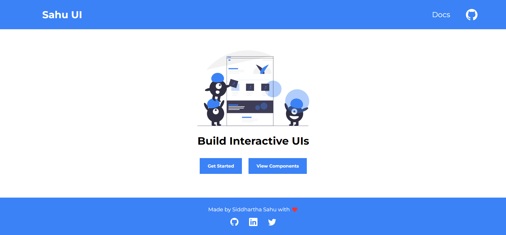
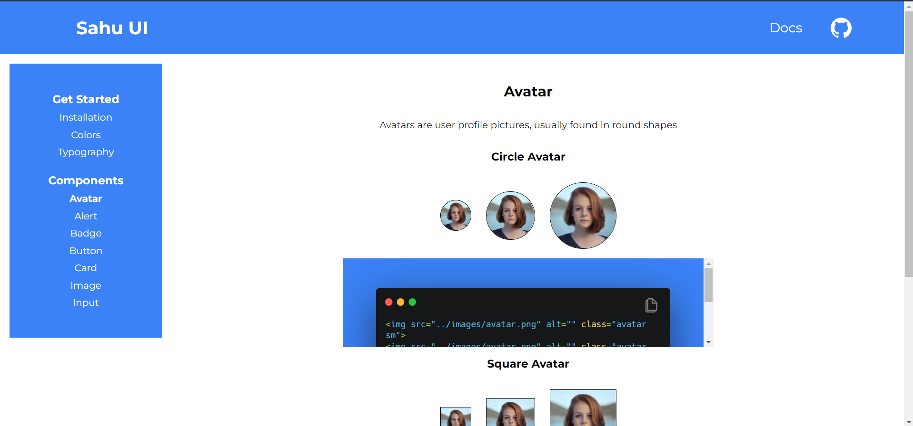

# Sahu UI

## Installation

Add the following code to the head section of your html document.
```html
<link rel="stylesheet" href="https://sahu-ui.netlify.app/style.css" />
```
or

Import my stylesheet into your CSS using the following code.
```css
@import urlhttps://sahu-ui.netlify.app/style.css);
```

## Components
- Alert
- Avatar
- Badge
- Button
- Card
- Image
- Input

## Screenshots

### Landing Page

### Component Page

